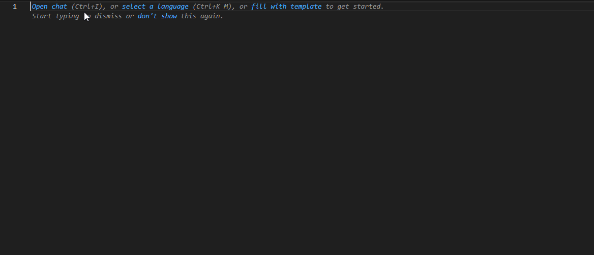

# Alcatel Language Support for VS Code

<p align="center">
  
</p>

<p align="center">
  <a href="https://marketplace.visualstudio.com/items?itemName=alcatel-language-support">
    
  </a>
  <a href="https://marketplace.visualstudio.com/items?itemName=alcatel-language-support">
    
  </a>
  <a href="https://marketplace.visualstudio.com/items?itemName=alcatel-language-support">
    
  </a>
</p>

## Overview

This extension provides comprehensive language support for Alcatel-Lucent switch configurations, enhancing your workflow with syntax highlighting, intelligent autocomplete, hover documentation, and an integrated command reference.

<p align="center">
  
</p>

## Features

- **Syntax Highlighting**: Custom syntax highlighting for Alcatel config files
  - Comment recognition with `!` prefix
  - Command and parameter distinction

- **Intelligent Auto-completion**:
  - Context-aware command suggestions based on the current command structure
  - Support for both top-level commands and nested parameters
  - Command parameters with appropriate descriptions

- **Hover Information**:
  - Displays information about commands when hovering
  - Shows available parameters for each command
  - Command documentation on demand

- **Command Reference**:
  - Integrated reference for Alcatel switch commands
  - Easy access to command syntax and parameters

## Installation

### From VS Code Marketplace
1. Open VS Code
2. Go to Extensions (Ctrl+Shift+X)
3. Search for "Alcatel Language Support"
4. Click Install

### Manual Installation
1. Download the `.vsix` file from the [releases page](https://github.com/phillipyosief/alcatel-language-support/releases)
2. In VS Code, go to Extensions (Ctrl+Shift+X)
3. Click on the "..." menu and select "Install from VSIX..."
4. Select the downloaded file

## Usage

- Files with extensions `.ale` or `.alcatel` will automatically be recognized
- Create or open an Alcatel configuration file
- Use the integrated command completion by pressing Ctrl+Space
- Hover over commands to see documentation
- Use `!` at the beginning of a line to create comments

### Configuration Examples

```alcatel
! Sample VLAN configuration
vlan 10
  name "Management VLAN"
  admin-state enable
  members port 1/1/1 untagged
  
! Interface configuration
interface port 1/1/1
  admin-state enable
  alias "Uplink to Switch-B"
  
! IP configuration
ip interface MGMT
  address 192.168.1.1/24
  vlan 10
  admin-state enable
```

## Requirements

No additional requirements or dependencies are needed.

## Extension Settings

This extension currently doesn't add any configurable settings.

## Known Issues

None reported yet. If you encounter any problems, please [open an issue](https://github.com/phillipyosief/alcatel-language-support/issues).

## Contributing

Contributions are always welcome! Please feel free to submit a Pull Request.

1. Fork the repository
2. Create your feature branch (`git checkout -b feature/amazing-feature`)
3. Commit your changes (`git commit -m 'Add some amazing feature'`)
4. Push to the branch (`git push origin feature/amazing-feature`)
5. Open a Pull Request

## License

This project is licensed under the MIT License - see the LICENSE file for details.

**Enjoy configuring your Alcatel switches with enhanced editor support!**
